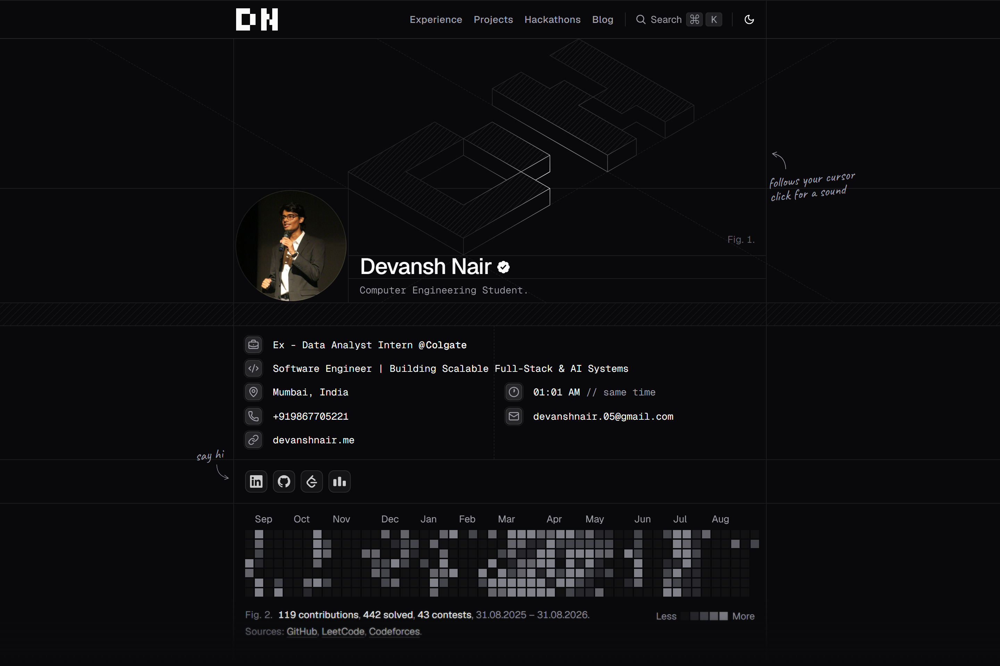

<p>
  <picture>
    <source media="(prefers-color-scheme: dark)" srcset="https://shieldcn.dev/header/grid.svg?title=devanshnair.me&amp;subtitle=A+pixel-perfect+dev+portfolio+and+interactive+showcase.&amp;logo=data%3Aimage%2Fsvg%2Bxml%2C%3Csvg+xmlns%3D%27http%3A%2F%2Fwww.w3.org%2F2000%2Fsvg%27+fill%3D%27none%27+viewBox%3D%270+0+24+24%27%3E%3Cpath+fill%3D%27%2523000%27+d%3D%27M1+6h3v12H1z+M4+6h4v3H4z+M4+15h4v3H4z+M8+9h3v6H8z+M13+6h3v12h-3z+M19+6h3v12h-3z+M16+9h2v3h-2z+M17+12h2v3h-2z%27%2F%3E%3C%2Fsvg%3E&amp;size=wide&amp;mode=dark&amp;theme=zinc&amp;font=geist" />
    
  </picture>
</p>

→ Live site: [devanshnair.me](https://devanshnair.me)

[](https://devanshnair.me)

## Overview

### Featured

- Clean & modern design
- Light/Dark themes
- vCard integration
- SEO optimized ([JSON-LD schema](https://json-ld.org), sitemap, robots)
- AI-ready with [/llms.txt](https://llmstxt.org)
- Spam-protected email
- Installable as PWA

### Tech Stack

| Layer | Technology |
| :--- | :--- |
| **Framework** | [Next.js 16](https://nextjs.org) (App Router, Turbopack, Server Components) |
| **Language** | [TypeScript](https://www.typescriptlang.org) (Strict Mode) |
| **Styling** | [Tailwind CSS v4](https://tailwindcss.com) & [Base UI](https://base-ui.com) |
| **UI Components** | [shadcn/ui](https://ui.shadcn.com) |
| **Animations** | [Motion](https://motion.dev) (React 19) |
| **Content Engine** | [Fumadocs](https://fumadocs.vercel.app) & MDX |
| **Activity APIs** | GitHub GraphQL, LeetCode GraphQL API, Codeforces API |

---

## Getting Started

### Prerequisites

* [Node.js](https://nodejs.org/) (v20+ recommended)
* [pnpm](https://pnpm.io/) (`corepack enable pnpm` or `npm i -g pnpm`)
* [Bun](https://bun.sh/) (for build and registry scripts)

### Installation

```bash
# Clone repository
git clone git@github.com:Devanshnair/Portfolio-DevanshNair.git
cd Portfolio-DevanshNair

# Install dependencies
pnpm install

# Start local development server
pnpm dev
```

The site will run locally at `http://localhost:3000` (or `https://ncdai.localhost` if configured in your hosts).

---

## Available Scripts

| Command | Description |
| :--- | :--- |
| `pnpm dev` | Starts the Next.js development server with hot-reloading |
| `pnpm build` | Compiles registry and builds optimized production bundle |
| `pnpm start` | Runs the production build locally |
| `pnpm check-types` | Validates TypeScript types across the entire project |
| `pnpm lint` | Runs ESLint rules and checks code quality |
| `pnpm format:write` | Formats codebase with Prettier |
| `pnpm test:run` | Runs unit tests with Vitest |

---

## License

This project is licensed under the [MIT License](https://github.com/Devanshnair/Portfolio-DevanshNair/blob/main/LICENSE). Personal content, name, and branding are proprietary to Devansh Nair.
